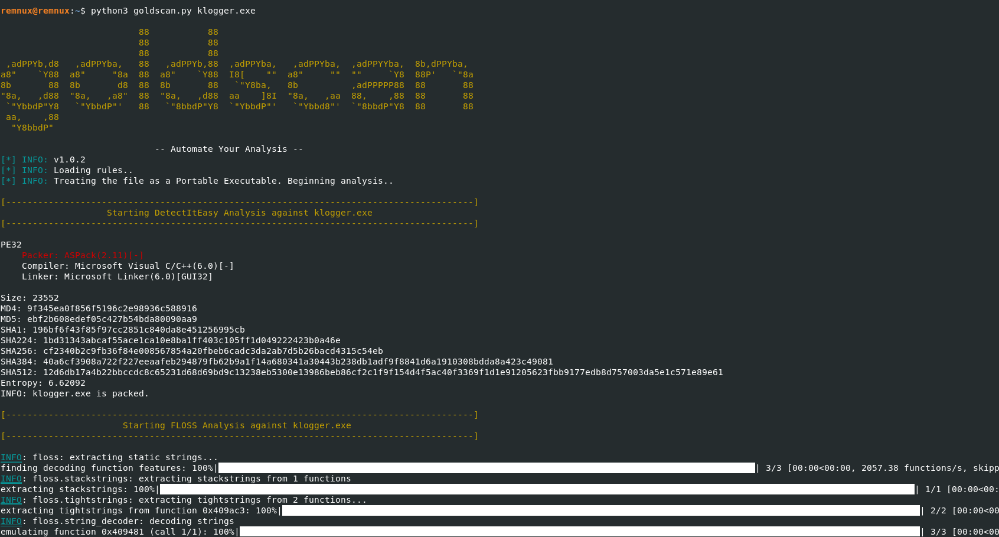

# goldscan

## Overview
This script automates the static analysis process for potential malware samples. It will take follow-on analysis actions based on the output of earlier analysis and attempt to deobfuscate as much as it can for you. To ensure that the script is able to complete without issue, it's recommended to increase the RAM allocated to the VM to 8GB.

## Quickstart

1. Download the script
2. Copy the script into your REMnux Virtual Machine
3. Ensure it is executable: `chmod +x goldscan.py`
4. Run the script against the sample: `python3 goldscan.py [file]`

Most of the tools have their output written to a tool-specific document in the directory created by the script for the sample. The output can also be redirected using STDOUT.

## Tools Automated
- DetectItEasy
- UPX
- FLOSS
- Base64Dump
- YARA
- Capa
- PEFrame
- Speakeasy
- Cobalt Strike Metadata Extraction
- peepdf
- oleid
- oleobj
- olevba
- oledump
- ViperMonkey
- peepdf
- pdf-parser
